# User manual

Remote control of a Rigol DS1000Z-E oscilloscope from Linux: a graphical
front end, a terminal client and Python scripting, all working through
one server, `scopebridge-server`, which talks to the scope.

The screenshots were taken with a Rigol DS1202Z-E over LAN, its probe on
the scope's 1 kHz calibration output; those marked *simulated* show the
server's simulated scope. Everything here was developed and tested with a
DS1202Z-E only; see the README's Compatibility section for other models.

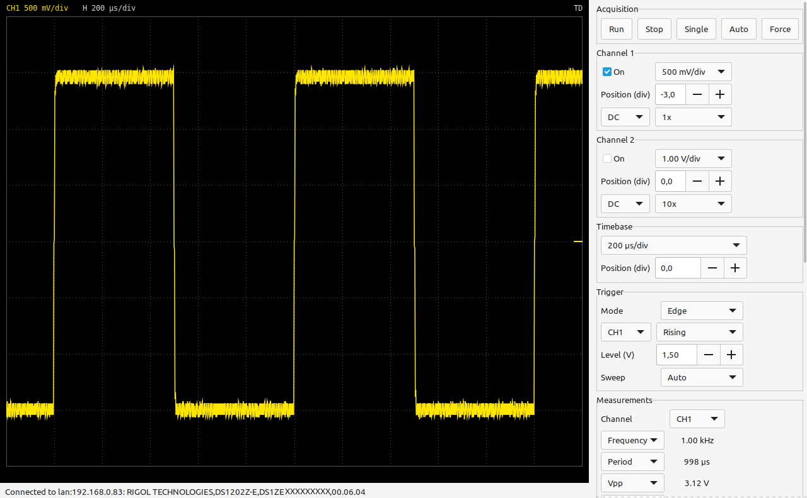

## Contents

1. [Getting started](#1-getting-started)
2. [The main window](#2-the-main-window)
3. [Channels, timebase and trigger](#3-channels-timebase-and-trigger)
4. [Measurements and recording](#4-measurements-and-recording)
5. [Capturing the whole memory](#5-capturing-the-whole-memory)
6. [Cursors](#6-cursors)
7. [Math](#7-math)
8. [FFT](#8-fft)
9. [XY display](#9-xy-display)
10. [Pass/fail testing](#10-passfail-testing)
11. [Reference waveforms](#11-reference-waveforms)
12. [Bus decoding: UART, I2C, SPI](#12-bus-decoding-uart-i2c-spi)
13. [Timing code](#13-timing-code)
14. [Setups, screenshots and export](#14-setups-screenshots-and-export)
15. [The terminal client](#15-the-terminal-client)
16. [Scripting in Python](#16-scripting-in-python)
17. [Several clients, the session log and replay](#17-several-clients-the-session-log-and-replay)
18. [The web interface](#18-the-web-interface)
19. [Troubleshooting](#19-troubleshooting)

## 1. Getting started

Build everything once (see the README for the requirements):

```
make
```

Then start the server and the GUI together:

```
./scopebridge.sh                       # the scope on USB, found by itself
./scopebridge.sh --lan 192.168.0.83    # the scope on the network
./scopebridge.sh --sim                 # no scope: a simulated one
```

`scopebridge.sh` stops the server when you close the window. The scope's
network address is shown on the scope under Utility -> IO Setting -> LAN
Conf. For USB access without root, run `sudo make install-udev` once
(see the README's *USB access*).

The parts can also be started on their own, which is what you do to use
the terminal client or scripts:

```
./bin/scopebridge-server --lan 192.168.0.83 &     # or --usb /dev/usbtmc0, or --sim
./bin/scopebridge-gui
./bin/scopebridge-term
```

## 2. The main window

The display on the left shows the scope's screen: a graticule of 12 x 8
divisions, CH1 in yellow, CH2 in cyan, math in magenta. Along the top are
each channel's scale, the timebase, and the trigger status (`TD`
triggered, `WAIT`, `STOP`, ...); a short line at the right edge marks the
trigger level. The status line at the bottom shows the connection and any
errors.

The panel on the right has the controls. They follow the scope: whatever
you change on the scope's front panel appears in the GUI within about
1.5 s, and whatever you change in the GUI is sent to the scope and read
back.

**Acquisition**: *Run*, *Stop*, *Single* (one triggered acquisition),
*Auto* (the scope's autoscale) and *Force* (trigger now). Below them the
acquisition mode: *Normal*; *Average* over 2 ... 1024 frames, which lowers
noise on a repeating signal; *Peak detect*, which keeps each interval's
highest and lowest sample so that short glitches show even at slow
timebases; *High res*, which averages neighbouring samples. *Memory* sets
how many points each acquisition holds: *Auto* lets the scope choose, or
12k ... 24M points with one channel on (6k ... 12M with two). The sample rate
shown follows from it: a deep memory keeps the rate high at slow
timebases, which captures and bus decoding need; a shallow one makes
captures quick. The scope changes the depth only while it runs: after a
capture, press *Live* first.

Live view runs at about 16 updates per second with one channel shown and
about 5 with two, over USB; over Wi-Fi LAN somewhat fewer.

## 3. Channels, timebase and trigger

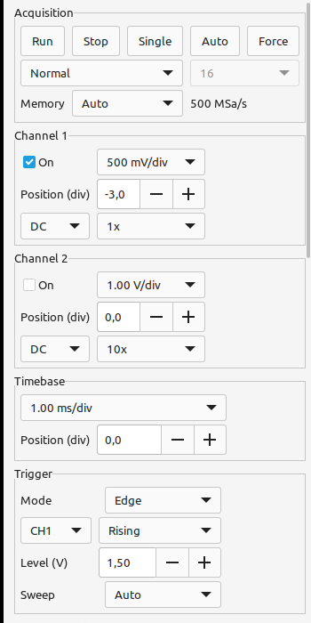

**Channel 1 / Channel 2**: *On*, the scale (V/div), the position in
divisions (the trace moves up with positive values), the coupling (DC, AC,
GND) and the probe ratio. Set the probe ratio to match the switch on the
probe, or every voltage is off by their ratio.

**Timebase**: the scale (s/div) and the position in divisions. From about
5 ms/div the scope fills its screen slowly from the left, and the GUI shows
it the same way.

**Trigger**: choose the mode first.
- *Edge*: source (CH1, CH2, AC line, EXT), slope (rising, falling,
  either) and level.
- *Pulse*: triggers on a pulse width: a positive or negative pulse wider
  (`>`) or narrower (`<`) than *Width*, or within a range (*Range from* ...
  *to*).
- *Slope*: triggers on the time a signal takes between two levels,
  A and B, with the same kinds of conditions.

*Sweep*: Auto (runs without a trigger), Normal (waits for one) or Single.

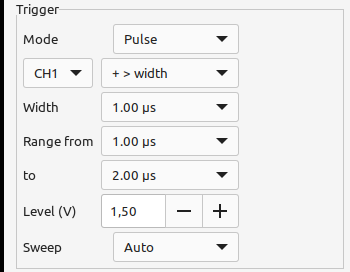

<br clear="right">

## 4. Measurements and recording

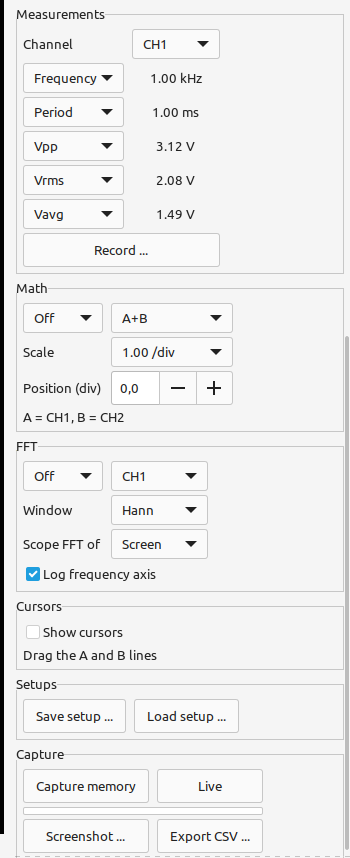

The **Measurements** panel shows five measurements of one channel,
measured by the scope. Choose the channel at the top and an item in each
slot: frequency, period, Vpp, Vmax, Vmin, Vtop, Vbase, Vamp, Vavg, Vrms,
rise and fall time, positive and negative width, positive and negative
duty cycle. A slot shows `-` when the scope cannot measure the item, for
example a rise time too fast for the timebase or a frequency at a
timebase showing hundreds of periods.

There are five slots because the scope keeps at most five measurements
running; more would make each take half a second.

**Record ...** asks for a CSV file and then writes a row at every
update: time, seconds since the start, channel and the five values.
Press it again (*Stop recording*) to finish. While recording, the
channel and items cannot be changed, so the columns stay the same.
Good for watching a signal drift over hours:

```
time,elapsed_s,ch,freq_Hz,period_s,vpp_V,vrms_V,vavg_V
2026-09-26 11:43:56.65,0.02,1,1.00000E+03,1.00000E-03,3.12000E+00,2.08000E+00,1.49000E+00
```

<br clear="right">

## 5. Capturing the whole memory

The live view shows the scope's screen, 1200 points. **Capture memory**
reads the scope's whole acquisition memory (up to 24 million points) of
every channel that is on; this stops the scope. A 6-million-point memory
takes about 8 s over USB; the progress bar shows how far it is.

The display then shows the capture (*CAPTURE* at the top right):

- the **mouse wheel** zooms in and out around the pointer;
- **dragging** pans;
- a **right click** shows the whole capture again;
- **hovering** shows the time and each channel's voltage under the pointer
  at the bottom.

However far you zoom out, each pixel column shows the lowest and highest
sample in it, so a short glitch is never lost. **Live** returns to the
live view and restarts the scope.

## 6. Cursors

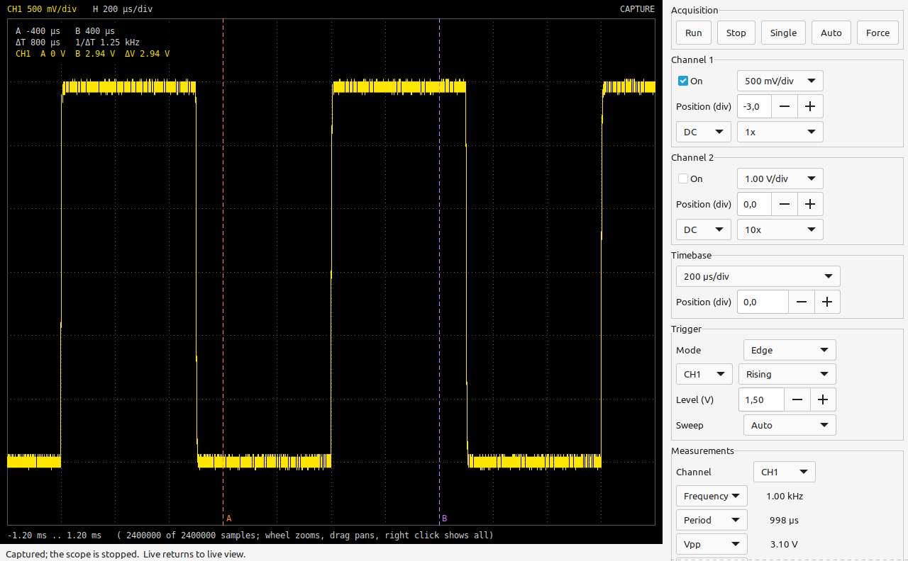

**Show cursors** puts two time cursors, A and B, on the display; drag a
cursor line to move it. The box at the top left shows both times, their
difference ΔT and its inverse 1/ΔT, and for each channel the voltage at A
and B and their difference ΔV. In a capture the voltages are the exact
samples under the cursors, and the cursors stay on the signal while you
zoom and pan.

The GUI's cursors are its own: they are not the scope's cursors, which
can be set differently on the scope at the same time.

## 7. Math

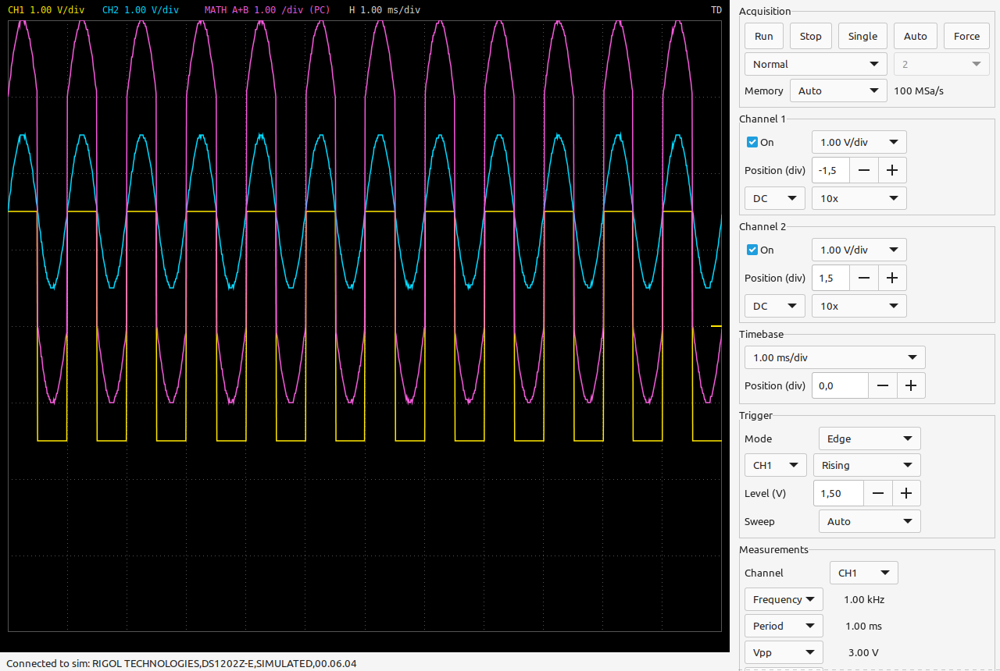

*Simulated scope: a square wave on CH1, a sine on CH2, and A+B.*

The **Math** panel adds a trace combining the two channels: A+B, A-B,
AxB, or A/B (A is CH1, B is CH2). Choose who computes it:

- **Scope**: the scope's own math channel. After a change the scope takes
  one to three seconds before the result appears.
- **PC**: computed on your computer (by `scopebridge-server`) from the channels'
  data, which also works on captures. Both channels must be on. A/B is scope only.

*Scale* and *Position* place the trace like a channel's.

## 8. FFT

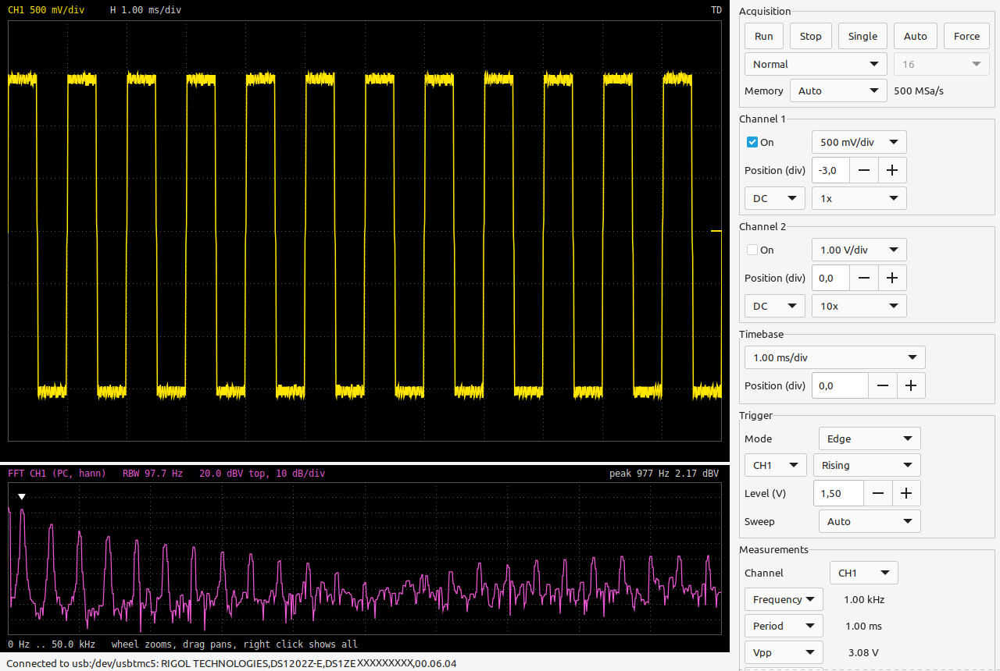

The **FFT** panel opens a spectrum display under the scope display.
Choose the source channel, the window, and who computes it:

- **Scope**: the scope's math channel in FFT mode, of its screen data or
  its memory (*Scope FFT of*). The scope has one math channel, so scope
  math and scope FFT cannot run together; choosing one switches the other
  off.
- **PC**: computed on your computer. Live, it transforms each screen
  frame. After *Capture memory* it transforms the whole capture.

The spectrum shows level in dBV (dB relative to 1 V RMS: a sine of 1 V
amplitude is -3 dBV) at 10 dB per division. The **peak marker** points at
the strongest line in view; the header gives its frequency and level, and
the resolution (RBW). Zoom, pan and hover work as in a capture, and **Log
frequency axis** spreads the low frequencies out.

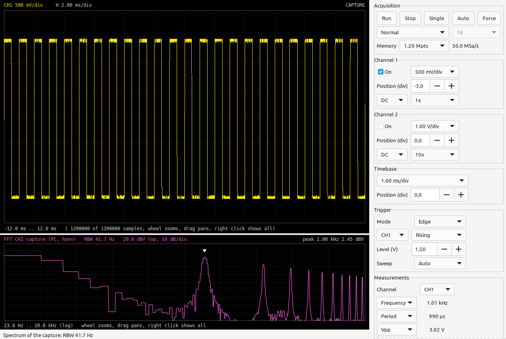

*The spectrum of a 24 ms capture (1.2 million points at 50 MSa/s): 42 Hz
resolution, the 1 kHz fundamental, and the square wave's odd harmonics.*

**Resolution.** A spectrum resolves frequencies about 1 / duration apart:
the live FFT of a 12 ms screen resolves about 100 Hz, and a capture's
spectrum about 1 / (capture length). A signal needs to be several
resolution steps above 0 Hz to be measured apart from the DC level: with
a 1 kHz signal, use at least 1 ms/div. At 200 µs/div (a 2.4 ms screen) a
1 kHz fundamental is too close to DC, and the peak marker may point at
leakage beside it.

**Windows.** *Hann* suits most signals. *Flat top* measures levels most
accurately (within 0.1 dB) but resolves less. *Rect* resolves most, but
levels between two bins read up to 4 dB low.

## 9. XY display

**Display -> XY** plots CH1 across and CH2 up, each at its own V/div and
position, on a square of 8 x 8 divisions: Lissajous figures, phase
between two signals, or a component's I/V curve with a current probe or
shunt on one channel. Both channels must be on.

The GUI draws XY itself from the two channels' live frames and leaves the
scope in its normal (YT) mode: in the scope's own XY mode its waveform
reads and measurements stop working. The protocol can still switch the
scope's mode (`tb mode xy`, or `roll` for slow signals).

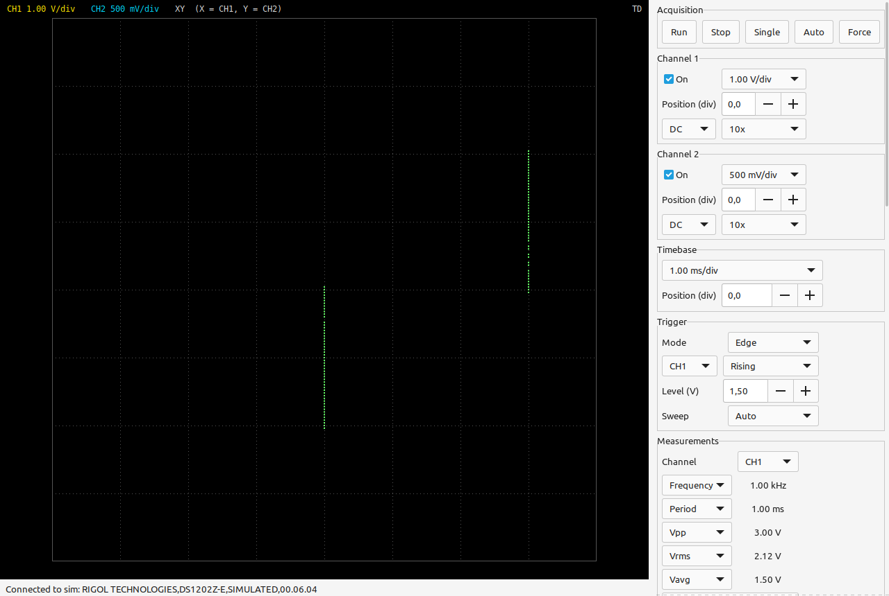

## 10. Pass/fail testing

The scope's mask test checks every acquired frame against a mask built
around a good waveform, and counts the frames that pass and fail.

1. Show a good signal, and choose the **Source** channel.
2. Set the margins: **Margin X** and **Margin Y**, in divisions, how far
   the waveform may stray sideways and up or down.
3. **Create mask** builds the mask around the waveform now (it appears on
   the scope's screen) and resets the counts.
4. **Start** runs the test. The panel shows the counts and the share that
   failed, updated every 1.5 s; the scope shows them too.

**Stop on fail** stops acquiring at the first failed frame, so the scope
keeps the bad waveform on screen: capture it to look at it closely.
**Reset** zeroes the counts, **Stop** pauses the test, **Off** ends it.

The test runs on the scope, frame by frame, far faster than the live view
updates (about 40 frames per second at 500 µs/div on the DS1202Z-E), and
keeps counting while the GUI shows live data. It does not run at
200 ms/div and slower, or in XY or roll mode.

## 11. Reference waveforms

A reference is a copy of a channel's screen kept for comparison: save one
before a change, and the live trace shows what changed.

Choose a slot, **R1** to **R4**, and a channel, then **Save**. The
reference is drawn in its own colour (R1 grey, R2 orange, R3 green, R4
pink) behind the live traces, and in capture views too. It stays at its
own times relative to the trigger, and in volts like the channel it came
from: change that channel's V/div or position and the reference follows,
so it always lines up with the live trace in real units.

References are kept by the server, so every client sees them, and last as
long as the server runs. **Export ...** writes one as a CSV of time and
volts; **Import ...** loads such a file, from this program or any other,
into the chosen slot. **Show references** hides or shows them all.

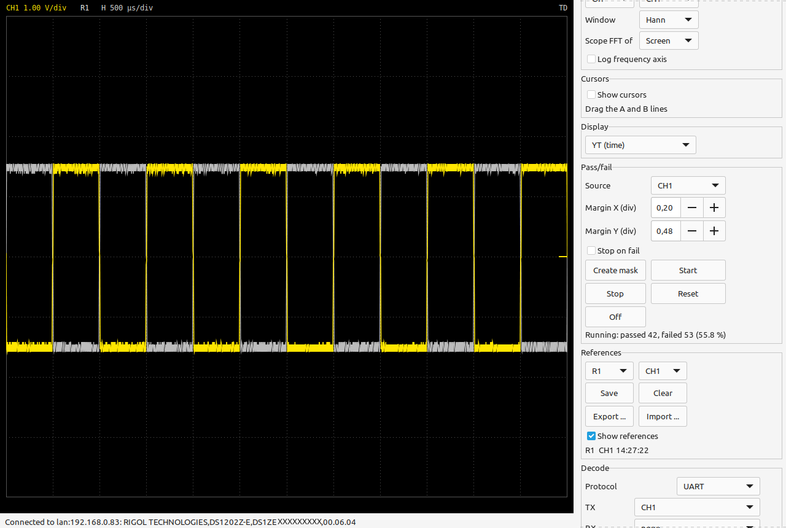

## 12. Bus decoding: UART, I2C, SPI

The server decodes serial traffic from the captured memory: every byte in
the capture, not just the screen, with its exact time.

1. Connect the bus: UART on one channel (TX), or two (TX and RX); I2C with
   SCL on one channel and SDA on the other; SPI with the clock on one and
   one data line on the other. Set each channel so the signal fills a few
   divisions.
2. Choose a timebase that spans the traffic you want, and **Capture
   memory** (or **Single** first, to catch one burst).
3. In the **Decode** panel choose the protocol and its settings, then
   **Decode capture**.

The decoded items appear along the bottom of the capture view, a lane per
channel, and in a list under the display. Choosing an item in the list
zooms the view to it. **Show as** switches between hex, ASCII, decimal and
binary. Items in red are errors: a UART parity or framing error, or an
I2C byte that was not acknowledged. A new capture is decoded again with
the same settings.

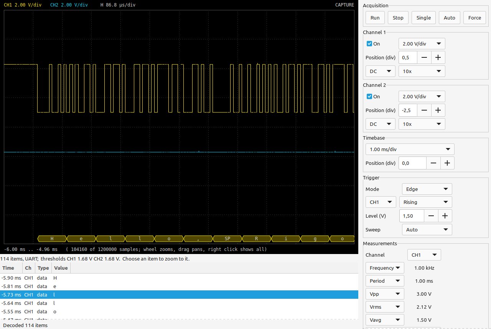

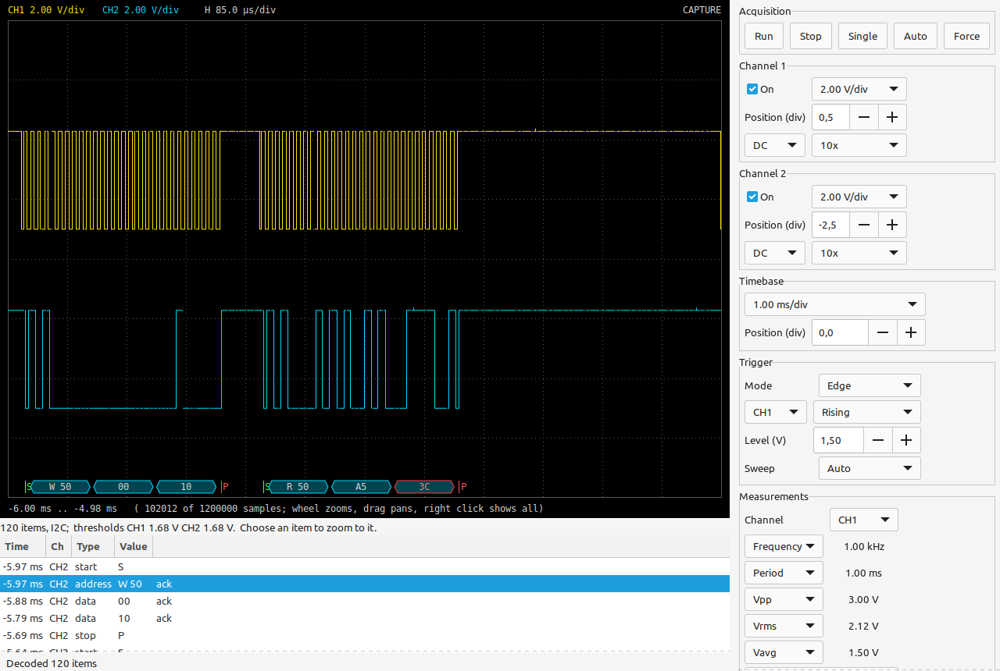

Settings:

- **UART**: TX and RX channels, baud rate (choose one or type any), data
  bits, parity, stop bits; **Idle low** for inverted lines such as RS232
  levels, **MSB first** for the rare devices that send that way. The
  capture needs at least 4 samples per bit: a slow timebase at a high
  baud rate is refused with a hint.
- **I2C**: which channel is SCL; SDA is the other. Addresses show as `W 50`
  or `R 50` (the 7-bit address and the direction).
- **SPI**: which channel is the clock; the data line is the other. The
  edge the data is valid on (rising for SPI modes 0 and 3, falling for 1
  and 2), the word length, bit order, and the timeout: a pause in the
  clock longer than it starts a new word. *auto* uses three times the
  usual time between clock edges; type a value (`5u`) if words run
  together. With two channels there is no chip select line.

Decoding starts where the bus is idle, so a capture that begins in the
middle of a byte does not show a wrong first byte. The thresholds are
halfway between each channel's lowest and highest level; the list's
heading shows them.

**Show on scope** sets up the scope's own bus decoder with the same
settings, so the scope draws the decoded bus on its screen as well. The
scope cannot send its decoded data back, which is why the server decodes
the capture itself.

The screenshots show the simulated scope, which can generate UART, I2C
and SPI traffic (the protocol document says how); decoding was tested on
it and on synthetic signals. The DS1202Z-E's own decoder was set up and
read back over the network.

## 13. Timing code

How long does a function take, every time it runs? How long from an
interrupt to the code that answers it, and how much does it vary? The
scope can tell, for any microcontroller: set a spare pin high when the
code starts and low when it ends, and each run is a pulse. The server
then measures every pulse in the capture: thousands of runs, to 10 ns at
full sample rate, with the shortest, the longest and where it is.

1. Mark the code: `examples/arduino/timing.h` has markers that cost one
   instruction (a port write) on AVR, STM32, RP2040 and ESP32, and a
   `digitalWrite` fallback for other Arduino boards:

   ```c
   #include "timing.h"

   TIMING_INIT ();              /* once: the marker pins as outputs */
   ...
   TIMING_A_ON ();
   crc = crc16 (message, length);
   TIMING_A_OFF ();
   ```

   Marker A goes on CH1. Marker B on CH2 can mark a second place: the
   body of the function's inner loop, the interrupt handler, the code
   that answers an event.
2. Choose a timebase that holds many runs, set the trigger to the marker,
   and **Capture memory**. The more samples, the finer the timing: the
   reply's *resolution* is the sample interval.
3. In the **Timing** panel choose the marker's channel and **Time
   capture**.

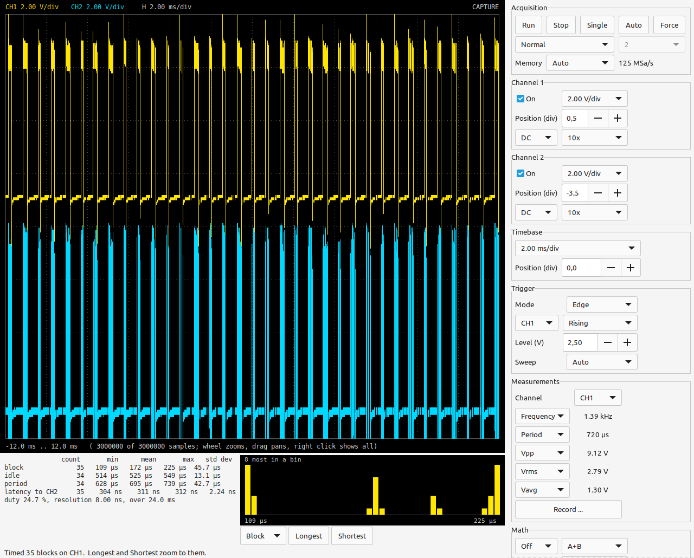

Under the display, a table gives the count, minimum, mean, maximum and
standard deviation of:

- **block**: the pulses, the code's run times;
- **idle**: the time between them;
- **period**: from one start to the next, how often the code runs;
- **latency** (with *Latency to* the other channel): from each start on
  the marker to the next rising edge on the other channel, such as from
  an interrupt's arrival to the task that handles it;
- **burst** (with a *Burst gap*): pulses closer together than the gap
  make a burst, and the table gives each burst's length and its number of
  pulses. A marker set in each pass of a loop then gives one burst per run
  of the loop, and the pulses count the passes.

The *duty* is the share of time spent in the code. The histogram shows how
the chosen set of values spreads: a tight single bar is code that always
takes the same time; several bars are paths through it (message sizes,
branches); a few far to the right are the outliers worth a look.
**Longest** and **Shortest** zoom the capture to that run, and the status
line tells its time.

Only whole pulses count: one cut off by the start or end of the capture
is left out, and so is a burst that may go on outside it. *Block is low*
times code marked by a low pulse instead. The threshold is halfway
between the channel's lowest and highest level.

To catch a rare slow run that the capture may miss, let the scope wait
for it: set the trigger to *Pulse* on the marker's channel, *+ > width*
(a positive pulse wider than) with a width a little over the usual
longest run, and press **Single**. The scope stops on the first run that is too long; capture,
and **Longest** takes you to it, with what the other channel did at the
time.

`examples/arduino/timing.c` is a complete example on an Arduino Uno: a
CRC-16 over messages of 16, 24 and 32 bytes, marker A around the call
and marker B around each byte. A timer interrupt every 2 ms, as real
programs have, makes an occasional run 25 µs longer. On the real Uno the
histogram shows a group per message size, each a few µs wide because the
CRC's time depends on the data, and the runs the interrupt hit as a group
of their own. Its README section shows a real run and what to look for,
and the bench (`bench.py`) runs it as a test.

The markers write the port registers directly, so they cost next to
nothing, 125 ns per marker on a 16 MHz AVR, but not zero.
`examples/arduino/delay.c` checks it all against a known delay: a block
of `_delay_us (100)` is 1602 cycles, and on the Uno it measured
100.222 µs with a spread of 3.5 ns, under one sample. The 0.1 % left
over is the Uno's resonator, which runs at 15.984 MHz. The terminal's `timing` command and
Python's `scope.timing()` give the same results:

```
scopebridge> timing 1 to 2
                    count       min      mean       max   std dev
  block               12  200.0 us  229.0 us  356.0 us   56.0 us
  idle                11  644.0 us  768.4 us  800.0 us   57.8 us
  period              11   1.00 ms   1.00 ms   1.00 ms   6.03 ns
  latency to CH2      12   20.0 us   25.0 us   30.0 us   4.08 us
  duty 22.90 %, resolution 10.0 ns, over 12.0 ms
  longest block at 3.10 ms, shortest at -4.90 ms
  block lengths:
    200.0 us |######################################## 10
    213.0 us |
    ...
    343.0 us |######## 2
```

The simulated scope has a timing signal for trying this out: `scpi
:SIMulator:SIGNal TIMing` gives blocks every 1 ms on CH1, some slower,
and bursts of pulses on CH2.

## 14. Setups, screenshots and export

**Save setup ...** stores the scope's setup in a file on your computer;
**Load setup ...** restores it: acquisition, channels, timebase, trigger
(edge, pulse and slope), math and the rest of what the scope keeps in its
own setup data. Loading takes a few seconds. Useful for
returning to a known configuration, or for keeping one per task.

**Screenshot ...** saves the scope's own screen as a BMP image.

**Export CSV ...** writes time and voltage columns: in live view the
current screen, in a capture the range in view (zoom in to at most 2
million samples).

## 15. The terminal client

`scopebridge-term` is the scope from a terminal. Numbers take SI suffixes
(`500m`, `2u`, `1k`); `help` lists the commands.

```
$ ./bin/scopebridge-term
Connected to lan:192.168.0.83: RIGOL TECHNOLOGIES,DS1202Z-E,...
scopebridge> ch 1 scale 500m offset -1.5
scopebridge> tb scale 200u
scopebridge> measure 1 freq vpp vrms vavg
  freq 998.0 Hz   vpp 3.12 V   vrms 2.09 V   vavg 1.48 V
scopebridge> watch 1
+------------------------------------------------------------------------+   200.0 us/div
|.     ###############   .     .     ###############   .     .     ######|
|      #             #               #             #               #     |
|.     #     .     . #   .     .     #     .     . #   .     .     #     |
|      #             #               #             #               #     |
|.    ##     .     . ##  .     .    ##     .     . ##  .     .    ##     |
|     #               #             #               #             #      |
|######.     .     .  ###############.     .     .  ###############.     |
+------------------------------------------------------------------------+
  # CH1 500.0 mV/div   CH1: freq 1.00 kHz  vpp 3.10 V
  Enter stops
scopebridge> tb scale 1m
scopebridge> single
scopebridge> wait
  triggered
scopebridge> capture 1
  reading memory: 100 %
  CH1: 6000000 points at 500.0 MSa/s, 12.0 ms; the scope is stopped
scopebridge> spectrum 1 flattop
  resolution 83.3 Hz, flattop window; strongest lines:
    1.  1.03 kHz   2.48 dBV
    2.  3.02 kHz   -7.06 dBV
    3.  5.01 kHz   -11.5 dBV
    ...
scopebridge> save capture.csv
scopebridge> quit
```

`acq type average averages 16 depth 1.2M` sets the acquisition (`acq`
alone shows it). The other commands: `status`, `run`, `stop`, `single`, `auto`, `force`,
`trig` (level, slope, source, sweep, mode), `screenshot FILE`,
`setup save|load FILE`, `scpi TEXT` (a raw SCPI command; a query ending in
`?` is answered), `raw JSON` (any request of the protocol), `sleep SECONDS`,
and `wait [SECONDS]`, which after `single` waits until the scope has
triggered (10 s by default).

Pass/fail, references and bus decoding have commands too:

```
scopebridge> mask on create run x 0.2 y 0.48
  pass/fail on, running, ch1, mask x 0.20 div, y 0.48 div
  passed 0   failed 0   total 0
scopebridge> mask
  pass/fail on, running, ch1, mask x 0.20 div, y 0.48 div
  passed 151   failed 0   total 151
scopebridge> ref save 1 1
  R1 = CH1 14:26:32
scopebridge> ref export 1 before.csv
  saved 1200 points to before.csv
```

and, on the simulated scope sending UART traffic (`capture` both channels
first):

```
scopebridge> decode uart tx 1 rx 2 baud 115200 show 3
  114 items
  -5.90 ms  CH1  48  'H'
  -5.81 ms  CH1  65  'e'
  -5.73 ms  CH1  6C  'l'
  ...  (show N for more)
  CH1 text: Hello, Rigol!\r\nHello, Rigol!\r\n...
  CH2 text: OK\r\nOK\r\n...
scopebridge> bus uart tx 1 baud 115200 format ascii
```

`bus` sets up the scope's own decoder (`bus 2 off` switches decoder 2
off); `ref` lists the references, `ref load SLOT FILE [N]` loads a CSV,
`ref clear` forgets them; `help` shows every option.

`timing N [to M] [gap S] [low]` times the blocks code marks on channel N
(section 13), with a histogram of their lengths.

The spectrum's resolution is 1 / the capture's duration, so a slower
timebase resolves finer: at 200 µs/div the capture lasts only 2.4 ms and
the flattop window's wide main lobe swallows a 1 kHz fundamental. Memory
depth and sample rate also depend on the channels that are on: with CH2
off the scope samples CH1 twice as fast, over half the time. The example
above had both channels on.

Commands can also come from a file, which makes a simple script; errors
are reported and the rest runs, and the exit status is 1 if anything
failed:

```
./bin/scopebridge-term < setup_and_measure.txt
```

## 16. Scripting in Python

For anything more than a list of commands, write Python using the `scopebridge`
module:

```python
from scopebridge import Scope

with Scope() as scope:
    scope.channel(1, scale=0.5, offset=-1.5, coupling="dc")
    scope.timebase(scale=1e-3)
    scope.edge_trigger(level=1.5, slope="rising")

    print(scope.measure(1, "freq", "vpp", "vrms"))

    for n in range(5):
        scope.single()
        if scope.wait_for_trigger(timeout=10):
            cap = scope.capture(1)                  # the whole memory
            cap.save_csv(f"capture_{n}.csv")
            f, level = cap.spectrum(window="flattop").peak()
            print(f"capture {n}: {cap.points} points, peak {f:.0f} Hz {level:.1f} dBV")
    scope.run()

    # measurements to CSV every second, for an hour
    scope.record("drift.csv", items=("freq", "vpp"), interval=1, duration=3600)
```

Pass/fail, references and decoding:

```python
    # a mask around the waveform now; count for a minute
    scope.mask(enable=True, source="ch1", x=0.2, y=0.48, create=True,
               reset=True, run=True)
    scope.sleep(60)
    m = scope.mask()
    print(f"{m['failed']} of {m['total']} frames failed")

    scope.ref_save(1, 1, label="before")         # compare later: scope.ref(1)

    # the bytes of a UART capture, as text
    scope.capture(1)
    items = scope.decode("uart", tx=1, baud=115200)
    print(Scope.text(items))

    # how long the code marked on CH1 takes (section 13)
    t = scope.timing(1, to=2)
    print(Scope.timing_report(t))
    print("slowest run:", t["block"]["max"], "s at", t["block"]["longest"]["t"])
```

Run it with `scopebridge_run.py`, which can start a server for it:

```
clients/python/scopebridge_run.py my_script.py                   # server running
clients/python/scopebridge_run.py --lan 192.168.0.83 my_script.py
clients/python/scopebridge_run.py --sim my_script.py             # try it out
```

`examples/scripts/` has four complete scripts: logging measurements,
a series of captures saved to disk, harmonic levels from a capture
spectrum, and a sweep of timebases with a screenshot at each. The README
lists all of `Scope`'s methods; `scope.request(...)` sends any request of
the protocol ([PROTOCOL.md](PROTOCOL.md)).

With numpy installed, sample data comes as numpy arrays.

## 17. Several clients, the session log and replay

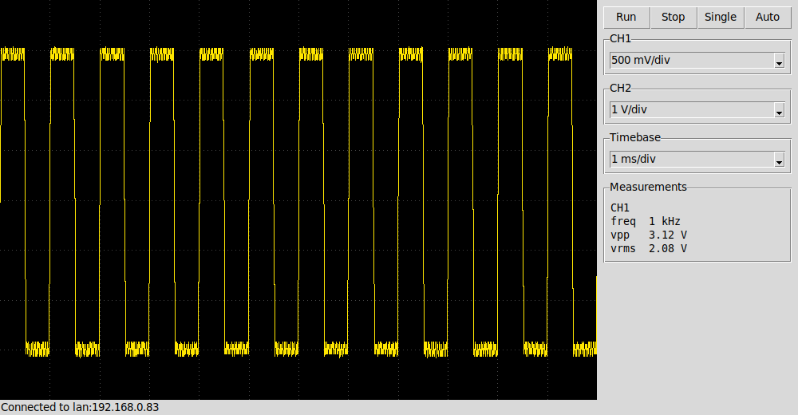

Any number of clients can use one server at once: the GUI and a running
script, the terminal client alongside, or a second GUI, such as the small
one written in Python and tkinter (`clients/python/scopebridge_tk.py`, above).
Each sees the scope's current state; requests are carried out in the order
they arrive.

**Session log.** Started with `--log`, the server writes every request and
reply of every client to a file, with timestamps:

```
./bin/scopebridge-server --lan 192.168.0.83 --log session.jsonl
```

```
{"t":"2026-09-26 11:37:23.68","client":1,"request":{"id":1,"cmd":"run"}}
{"t":"2026-09-26 11:37:23.68","client":1,"reply":{"id":1,"ok":true}}
```

**Replay.** A log can be replayed, which repeats what was done - in the
GUI or by a script - on the scope again:

```
clients/python/scopebridge_run.py --replay session.jsonl              # everything
clients/python/scopebridge_run.py --replay session.jsonl --client 2   # one client
clients/python/scopebridge_run.py --replay session.jsonl --timing     # at the original pace
```

**The server on another computer.** The server can run on the computer
the scope is connected to, such as a Raspberry Pi, with `--listen 0.0.0.0`,
and the clients anywhere on the network: `scopebridge --host raspberrypi.local`
starts only the GUI, and `scopebridge-term` and `scopebridge-run` take `--host` too.
The README's *The server on another computer* describes setting up a Pi,
and reaching it safely through SSH.

## 18. The web interface

The server can also serve its GUI to a browser: start it with `--web`
and a port,

```
scopebridge --web 8080                            # server, GUI and web
scopebridge-server --usb auto --web 8080                # the server alone
```

and open `http://localhost:8080/`. From other computers, tablets and
phones, start the server with `--listen 0.0.0.0` as well and open
`http://that-computer:8080/`; on a Raspberry Pi with the scope, the
server's service can do this from boot (see the README).

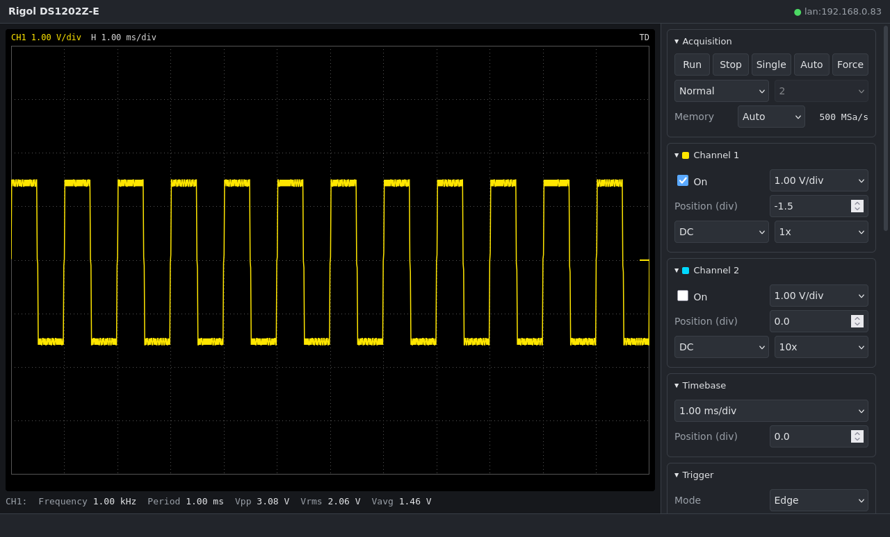

The page does what the desktop GUI does, laid out for a desktop or a
phone. The display shows the live traces with each channel's scale, the
timebase and the trigger status along the top, and the five measurements
under them. The panel beside it is in sections, which open and close:

- **Acquisition**: Run, Stop, Single, Auto, Force, the acquisition mode
  and averages, and the memory depth with the sample rate.
- **Channel 1, Channel 2, Timebase**: as in the desktop GUI.
- **Trigger**: edge, pulse width and slope, each with its own settings.
- **Measurements**: the channel measured, five items, and **Record**,
  which saves a row per update as a CSV file when stopped.
- **Capture and files**: *Capture memory* reads the whole memory of the
  channels on; then the wheel (or two fingers) zooms around the pointer,
  dragging pans and a double-click shows everything, as in section 5.
  *Live* returns to the live view. *Export CSV* saves the screen, or the
  part of a capture in view; *Screenshot* saves the scope's own screen.
- **Display and cursors**: XY, and the A and B cursors of section 6.
- **Math** and **FFT**: as in sections 7 and 8, by the scope or on the
  PC; the spectrum shows under the display. The spectrum of a capture is
  fetched whole, so zooming into it shows every line.
- **Decode**: as in section 12: the decoded items along the bottom of
  the capture and in a list under it; choosing one zooms to it.
- **Timing**: as in section 13: the table and histogram under the
  display, and Longest and Shortest to zoom to them.
- **References**, **Pass/fail**, **Setups**: as in sections 10, 11 and
  14; files are saved to, and loaded from, the browser's computer.

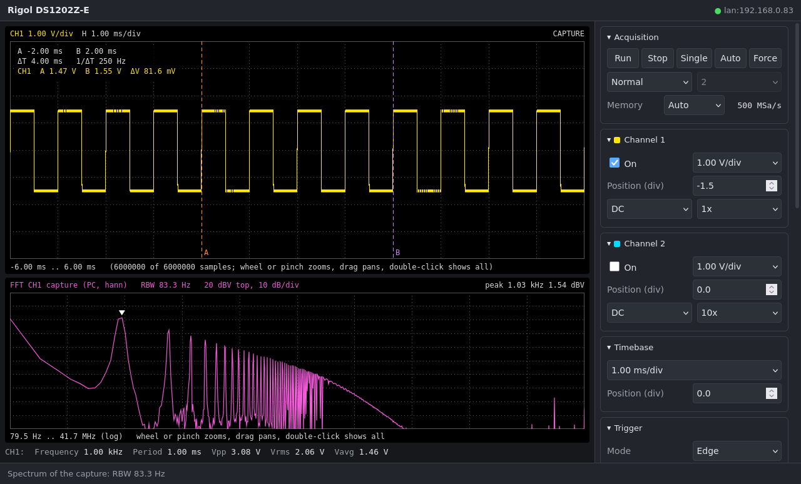

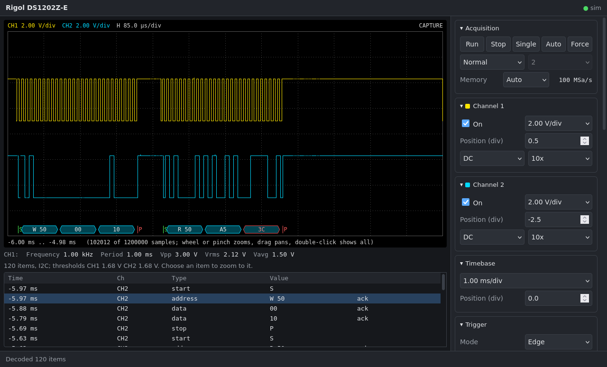

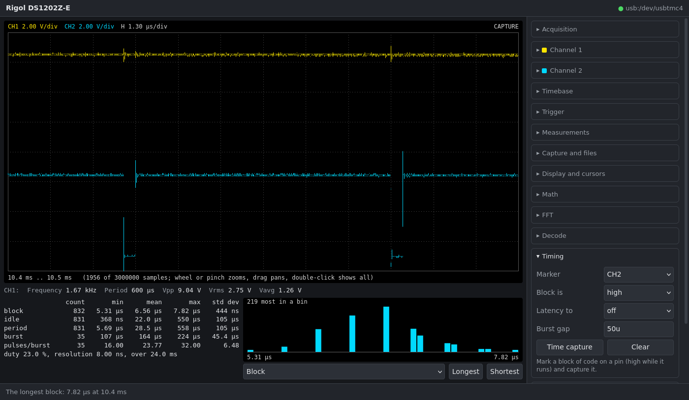

The page follows the scope like the desktop GUI: a change on the scope's
front panel, or by another client, shows within about 1.5 s. It
reconnects by itself if the server restarts.

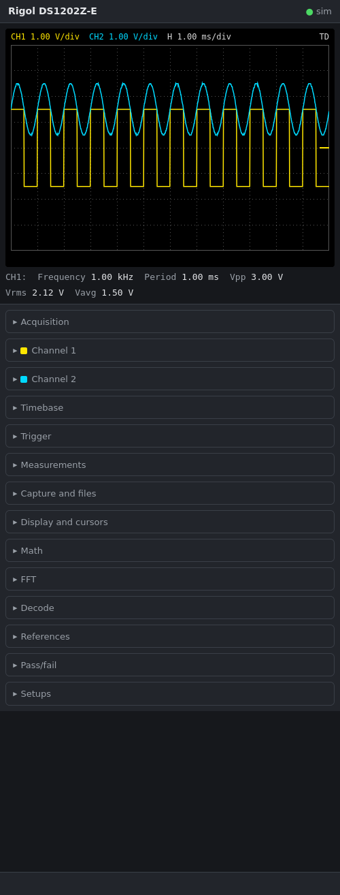

On a narrow screen, a phone or a small window, the sections go under the
display; open the ones in use. On a touch screen a capture zooms with two
fingers and pans with one, and a finger drags the cursors.

<br clear="right">

## 19. Troubleshooting

**"cannot connect to scopebridge-server".** The server is not running; start it
(`./scopebridge.sh` does both), or check `--port`.

**"LAN connection lost".** The scope went away in the middle of a request:
switched off, or the network broke. The next request connects again; if
the scope is still gone it says so ("does not answer").

**"Cannot open USB-TMC device".** The scope is off or not connected, or
the device is readable by root only: `sudo make install-udev` installs a
udev rule for it, and you need to be in the `plugdev` group (`groups`
shows; `sudo usermod -aG plugdev $USER`, then log in again). `ls -l
/dev/usbtmc*` should show the group `plugdev`; if not, plug the scope's
USB cable in again. The README's *USB access* has the details. The scope may appear as `/dev/usbtmc1`, `usbtmc4` ...; `scopebridge.sh`
finds it by itself.

**The scope's USB stops answering.** Power-cycle the scope. The software
avoids the known cause (clearing the USB device right after the scope has
booted locks its USB interface until the next power cycle).

**The live view is slow.** Showing both channels costs the scope time on
every update. Over Wi-Fi each exchange with the scope takes about 10 ms;
a cable is faster. Recording, cursors and zooming do not slow it.

**A measurement shows `-`.** The scope cannot measure it at the current
setting, typically a frequency at a very slow timebase, or rise and fall
times at a slow one. Change the timebase.

**The FFT peak is not where the signal is.** The capture or screen is too
short for the signal's frequency: see *Resolution* in section 8.

**After changing settings on the scope, the GUI shows the old value for a
moment.** The GUI reads the settings back every 1.5 s.
