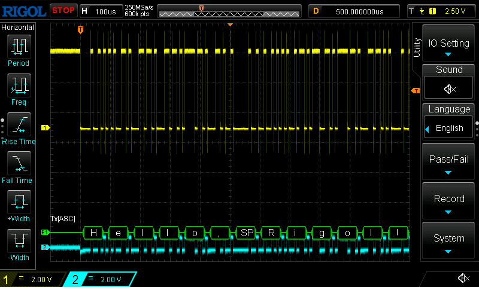
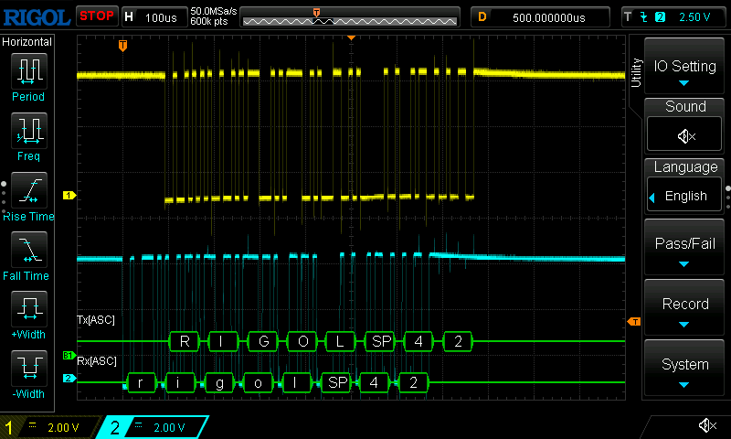
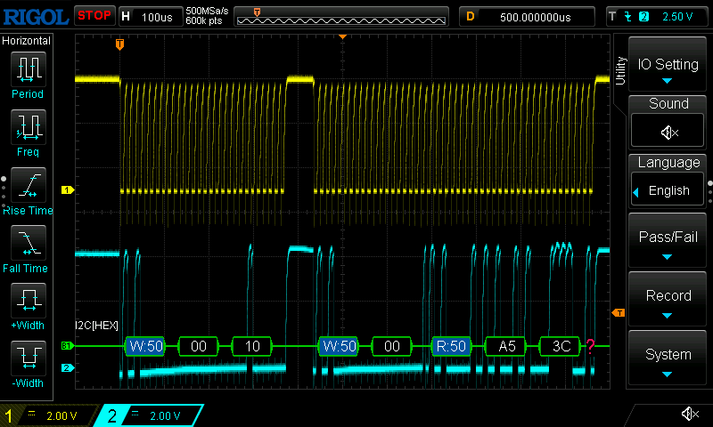
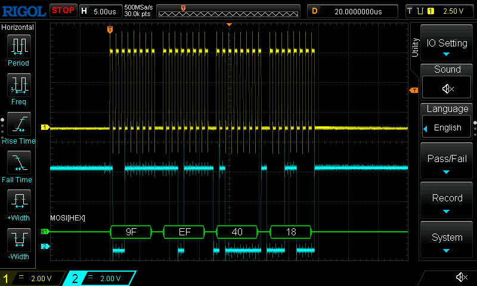
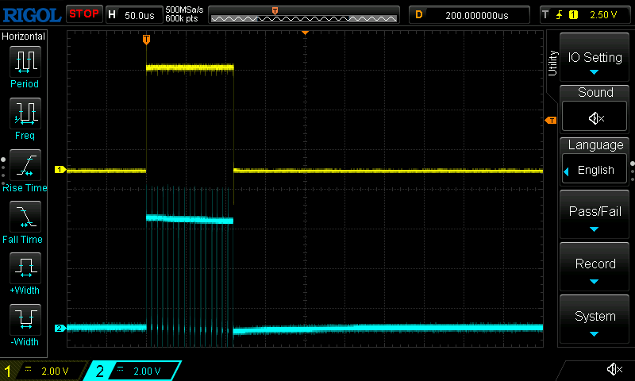
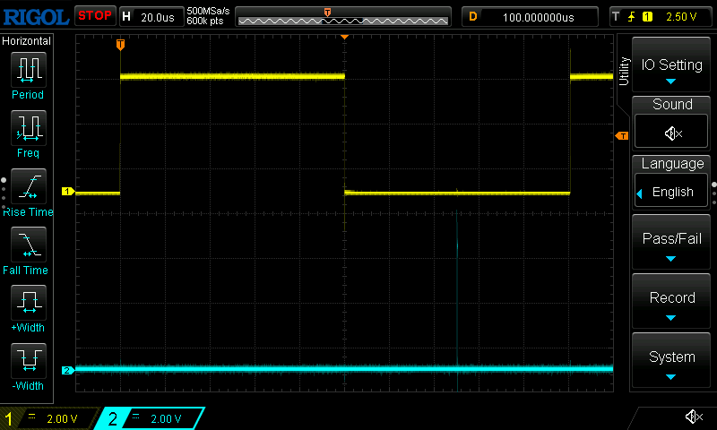

# Protocol test signals and code timing on an Arduino Uno

Three small programs in plain C (avr-gcc, no Arduino IDE) that make known
serial traffic for learning to look at protocols with the scope, and for
trying the bus decoding of `scopebridge-gui`, `scopebridge-term` and the Python API.
Each sends the same thing over and over, so you know what the decoder
should find, and each has build options for changing one thing at a time
and seeing what it does. `timing.c` shows how to time code with the
scope, using `timing.h`, markers for any microcontroller, and `delay.c`
checks that timing against a delay of known length.

The screenshots here are the scope's own screen, taken by the bench
(below) on a DS1202Z-E with the scope's bus decoder on.

| Program  | Protocol                  | CH1        | CH2         |
|----------|---------------------------|------------|-------------|
| `uart.c` | UART, 115200 8N1          | D1 (TX)    | D0 (RX)     |
| `i2c.c`  | I2C, about 75 kHz         | A5 (SCL)   | A4 (SDA)    |
| `spi.c`  | SPI mode 0, 1 MHz         | D13 (SCK)  | D11 (MOSI)  |
| `timing.c` | code timing: a CRC-16   | D13 (marker A) | D11 (marker B) |
| `delay.c` | a known delay: 100 µs    | D13 (marker A) | D11 (marker B) |

Clip both probes' ground leads to the Uno's GND. The Uno's signals swing
0 .. 5 V: 2 V/div with the trace at the bottom third of the screen shows
them well, and a trigger level of 2.5 V sits in the middle.

## An automated test bench

`bench.py` runs the programs and checks them with the scope, unattended:
for each test case it flashes the Uno, sets the scope up (channels,
timebase, trigger, memory depth, and the scope's own bus decoder, so its
screen shows the bus as well), triggers once, captures, decodes, and
checks the decoded bytes against what the program sends. It also measures
the real timing from the capture: the baud rate the Uno actually sends
(115200 comes out near 117647, 2.1 % fast), and the I2C and SPI clocks.
The timing.c case times the code instead, and checks the bytes per call.
The echo case sends text to the Uno through its USB serial port and
checks it on both lines: arriving on RX, and back in upper case on TX.

**Wiring, once for all the cases.** A pin a program does not use is an
input, so the pins of all three protocols can share the two probes:

| Probe | Joined with jumper wires               |
|-------|----------------------------------------|
| CH1   | D1 (UART TX), A5 (I2C SCL), D13 (SPI SCK, marker A) |
| CH2   | D0 (UART RX), A4 (I2C SDA), D11 (SPI MOSI, marker B) |
| both ground clips | GND                        |

D0 is driven by the Uno's USB chip through 1 kOhm, idle high: with the
other programs it only pulls the CH2 line up, which does no harm.

**The probes.** Each probe's switch (x1 or x10) must match the scope's
probe setting for its channel; the scope comes up at 10x after power-on,
whatever the probes say. The bench prints the settings at the start, and
checks every capture: each channel's high level must be about the Uno's
5 V. If not, it says what is wrong, for example

```
uart-115200-8n1  FAIL  no trigger within 5 s: CH1's high level is 0.48 V,
                       a tenth of 5 V: its probe is switched to x10, but
                       the scope's CH1 probe setting is 1x
```

x10 is the better choice for these signals: it loads a line far less (on
the I2C clock, a x1 probe slowed the rising edges enough to take the
clock from 78 to 74 kHz).

(Or run with `--ask`: the bench then stops before each program for the
probes to be moved.)

**Running it**, with the scope on USB and the Uno plugged in:

```
cd examples/arduino && make && cd ../..
clients/python/scopebridge_run.py --usb auto examples/arduino/bench.py
```

A run on a DS1202Z-E over USB, about 3.5 minutes in all:

```
Scope: RIGOL TECHNOLOGIES,DS1202Z-E,DS1ZEXXXXXXXXX,00.06.04
Results: bench-results/20260927-123736
Probe settings: CH1 10x, CH2 10x (as the probes' switches must be)

uart-115200-8n1  pass  1 whole lines, e.g. 'Hello, Rigol! 379\r\n'   [117536 baud]
uart-9600-8e1    pass  1 whole lines, e.g. 'Hello, Rigol! 156\r\n'   [9606 baud]
uart-115200-8o1  pass  1 whole lines, e.g. 'Hello, Rigol! 385\r\n'   [117521 baud]
uart-115200-8n2  pass  1 whole lines, e.g. 'Hello, Rigol! 383\r\n'   [117521 baud]
uart-1M-8n1      pass  3 whole lines, e.g. 'Hello, Rigol! 418\r\n'   [1000000 baud]
uart-echo        pass  sent 'rigol 42', echoed 'RIGOL 42'   [echo 12.4 us after each character]
i2c-100k         pass  write 00 10 to 50h, read A5 3C back (21 items)   [SCL 78.5 kHz]
spi-mode0-msb    pass  9F EF 40 18 (4 words)   [SCK 0.999 MHz]
spi-mode1        pass  9F EF 40 18 (4 words)   [SCK 0.999 MHz]
spi-mode2        pass  9F EF 40 18 (4 words)   [SCK 0.999 MHz]
spi-mode3        pass  9F EF 40 18 (4 words)   [SCK 0.999 MHz]
spi-lsb-first    pass  9F EF 40 18 (4 words)   [SCK 0.999 MHz]
timing-crc16     pass  35 blocks, 34 bursts of 16 .. 32 pulses   [block 108.5 .. 226.8 us, latency 0.3 us]
delay-100us      pass  23 blocks of 100.223 us (100.125 expected), markers 126.7 ns   [clock 15.9844 MHz (-0.098 %)]

14 of 14 passed; report: bench-results/20260927-123736/report.md
```

The measured column is the Uno as it really is. Its clock is a ceramic
resonator running 0.1 % slow, at 15.984 MHz: the delay case measures it,
and the baud rates agree (115200 comes out 2 % fast by the divider, and
0.1 % less by the clock). The I2C clock is set by delays plus the code
between them and the wait for SCL to rise. The cases: UART at 115200
8N1, with odd parity and with two stop bits, at 9600 with even parity, at
1000000 (exact at 16 MHz), and the echo; I2C; SPI in all four modes and
least significant bit first; the timing of timing.c's CRC; and delay.c's
known delay. Each is a few lines in `bench.py`, easy to copy for a
program of your own.

Each run leaves a folder in `bench-results/` with `report.md` (a table of
the cases, their results and timing), `results.json`, the output of the
flashing, and per case the scope's screenshot (`<case>.bmp`, with the
scope's own decoder on) and the decoded items (`<case>.csv`), or for
the timing cases their statistics (`<case>.txt`). The screenshot is a
new single acquisition at a timebase where the bus can be read (the
capture's timebase is chosen to hold a lot of traffic instead), taken
once the scope's messages after the memory read ("Can Operate Now!")
are gone. The exit
status is 1 if a case failed, so the bench can run from a script or a
build.

Options: `--only i2c` (the cases whose name contains it), `--port
/dev/ttyACM1` (if the Uno's port is not found by itself), `--skip-flash`
(the program is on the Uno already), `--out DIR`. `--sim` runs the cases
the simulated scope can play without an Uno (`scopebridge_run.py --sim
examples/arduino/bench.py --sim`), which is also how the bench itself is
tested.

## Building and uploading

Needs `avr-gcc`, `avr-libc` and `avrdude` (`sudo apt install gcc-avr
avr-libc avrdude`), and your user in the `dialout` group for the port.

```
cd examples/arduino
make                          # uart.hex, i2c.hex, spi.hex, timing.hex
make flash-uart               # build and upload (also flash-i2c, flash-spi,
                              # flash-timing)
make flash-uart PORT=/dev/ttyACM1
make flash-spi DEFS="-DSPI_MODE=1 -DLSB_FIRST=1"
```

The Uno shows up as `/dev/ttyACM0` (or `ttyUSB0` for clones with a CH340
chip: then add `PORT=/dev/ttyUSB0`).

## UART

`uart.c` sends `Hello, Rigol! 0`, `Hello, Rigol! 1`, ... with CR LF, every
10 ms, and echoes whatever it receives in upper case.



**On the scope**: CH1 on D1. Timebase 200 µs/div, position 1 ms (so the
trigger is near the left edge and the whole message fits), trigger CH1
falling edge at 2.5 V, sweep Normal. At 115200 baud a character takes
87 µs; a whole message about 1.6 ms.

**In the GUI**: *Capture memory*, then in *Decode* choose UART, TX CH1,
baud 115200, and *Decode capture*. The lane under the trace spells the
message; *Show as* ASCII shows it as text.

**In the terminal**:
```
tb scale 200u offset 1m
trig source ch1 slope falling level 2.5 sweep normal
single
wait
capture 1
decode uart tx 1 baud 115200
```

**Both directions**: also probe D0 with CH2, open a serial terminal on the
Uno (`screen /dev/ttyACM0 115200`, leave with Ctrl-A K), and type. CH2
shows your keystrokes going to the Uno, CH1 the upper-case echo between
the messages. Decode with RX CH2 as well (`rx 2`); capture both channels.
The bench's echo case does the same with `rigol 42`:



Two things the echo test found. Opening the serial port resets the Uno
(that is how the IDE starts its uploads), so a program sending to it must
wait out the bootloader, about a second, first. And the first `uart.c`
looked for received characters once a millisecond; at 115200 baud they
come every 87 µs and the receiver holds only two, so pasted text lost all
but the first. It now takes each as it comes, also while it is sending,
into a small buffer.

**Try**:
- decode at 9600 baud, or 230400: every byte becomes a framing error;
- build with `DEFS="-DPARITY=2"` (even parity) and decode with parity
  none: the parity bit is taken for the stop bit, and bytes with an even
  number of ones (parity bit 0) show framing errors; decode with parity even and all is
  well; decode with parity odd and every byte has a parity error;
- build with `DEFS="-DBAUD=9600"`, and measure the width of one bit with
  the cursors: 104 µs, 1 / 9600.

At 16 MHz, 115200 baud comes out 2.1 % fast (117647 baud). The server's
decoder samples the middle of each bit from each start bit afresh, so
this is well within its tolerance. The scope's own decoder is less
forgiving: with 11-bit frames (a parity bit, or two stop bits) it loses
step after two characters and shows nonsense, and set to 117647 it is
fine; the bench sets it so. 250000, 500000 and 1000000 baud are exact.

## I2C

`i2c.c` runs a write and a read every 2 ms:

```
S  50h W ack  00 ack  10 ack  P
S  50h W ack  00 ack  Sr  50h R ack  A5 ack  3C nack  P
```

The second is how a register or EEPROM is read: write the address to read
from, then a repeated start (Sr) and read. The master does not acknowledge
the last byte, which tells the device to stop sending.

With nothing on the bus the Uno plays the device too, pulling SDA low for
its acknowledges and sending A5 3C. To talk to a real device at 50h, such
as a 24C02 EEPROM (A0..A2 to GND), build with
`DEFS="-DSIMULATE_DEVICE=0"`: the write then stores 10 at address 00, and
the read returns what the EEPROM holds. With no device answering, the
address byte is not acknowledged (shown in red) and the transaction ends.

The Uno's internal pull-ups (about 35 kOhm) are enough at this speed, but
the edges rise slowly: with a probe at x1 on SCL, 0.5 to 4.5 V took
5.75 µs, more than half of a bit, while the falls, driven, took 10 ns.
4.7 kOhm from each line to 5 V makes them sharp. Look at a rising edge at
1 µs/div with and without the resistors, and with the probe at x1 and x10
(x10 loads the line far less).



**On the scope**: CH1 on A5 (SCL), CH2 on A4 (SDA). Timebase 100 µs/div,
position 500 µs, trigger CH2 falling edge at 2.5 V, sweep Normal (the
start condition is SDA falling while SCL is high).

**In the GUI**: capture, then *Decode*: I2C, SCL CH1.

**In the terminal**:
```
tb scale 100u offset 500u
trig source ch2 slope falling level 2.5 sweep normal
single
wait
capture 1
capture 2
decode i2c scl 1 sda 2
```

**Try**: decode with SCL and SDA swapped; zoom into a start and a stop
condition and see SDA change while SCL is high, and every data bit change
while SCL is low.

**Time the clock**: `timing 1` after a capture gives SCL's high and low
times. That is how this program's first version was found to run at
45 kHz, not the 100 kHz its delays add up to: its pin helper was a called
function with the pin number as a variable, and each pin change took
about 45 cycles, three per bit. Made `inline`, each change is one `sbi`
or `cbi` instruction. The scope shows what the code really does, not what
it was meant to do.

**The repeated start**: the scope's own decoder then still misread the
read transaction, while the server's decoded it. The program let SCL go
and pulled SDA low 2.5 µs later for the repeated start, but through the
internal pull-up and a x1 probe SCL was only at about 3 V by then, and
I2C counts 0.7 of 5 V, 3.5 V, as high. The server's threshold, halfway,
saw a start; the scope's decoder, and perhaps a real device, did not. A
master should let SCL go and wait until it reads high (as it must anyway
for a device that holds SCL low to make it wait), and now this one does;
the clock is about 75 kHz for it.

## SPI

`spi.c` sends 9F EF 40 18 at 1 MHz every 100 µs, with the chip select on
D10 low during the burst (a third channel would show it; the DS1202Z-E
has two, so the decoders find the words from the pauses in the clock).



**On the scope**: CH1 on D13 (SCK), CH2 on D11 (MOSI). Timebase 5 µs/div,
position 25 µs, trigger CH1 rising edge at 2.5 V, sweep Normal. At 1 MHz
every clock edge can trigger, so the words may start anywhere on the
screen; to start at the first word, trigger on the pause before it:
*Pulse*, CH1, *- > width* 50 µs (*+ > width* for modes 2 and 3, whose
clock idles high).

**In the GUI**: capture, then *Decode*: SPI, clock CH1, data valid on the
rising edge, 8 bits.

**In the terminal**:
```
tb scale 5u offset 25u
trig source ch1 slope rising level 2.5 sweep normal
single
wait
capture 1
capture 2
decode spi clk 1 data 2
```

**Try**:
- decode with 16 or 32-bit words: 9FEF 4018, or 9FEF4018;
- decode on the falling edge: the data is sampled as it changes, and the
  bytes come out wrong or shifted;
- build with `DEFS="-DSPI_MODE=1"` (data valid on the falling edge) and
  find the setting that decodes it; then `-DLSB_FIRST=1` and turn on
  *LSB first*.

## Timing code

How long does a piece of code take, every time, and how much does it
vary? Set a pin when the code starts and clear it when it ends: each run
is a pulse, and scopebridge-server times every pulse in a capture (see the
manual's *Timing code* section).

`timing.h` has the markers, for this and other microcontrollers:

```c
#include "timing.h"

TIMING_INIT ();              /* once: the marker pins as outputs */

TIMING_A_ON ();
result = crc16 (message, length);
TIMING_A_OFF ();
```

On the Uno they are single `sbi`/`cbi` instructions (125 ns) on D13
(A) and D11 (B). For an STM32 (BSRR), RP2040 (SIO) or ESP32 (W1TS/W1TC)
the header writes the port registers the same way, and on other Arduino
boards it falls back to `digitalWrite`; or define the macros yourself
before including it. Only the AVR version has been run on hardware; the
others compile, and follow the vendors' register descriptions.

`timing.c` times a CRC-16, bit by bit, over messages of 16, 24 and 32
bytes in turn: marker A high for each call, marker B high for each byte.
A timer interrupt every 2 ms does 25 µs of "housekeeping", as a real
program's would, and lengthens whichever CRC it lands in.



**On the scope**: CH1 on D13, CH2 on D11, 2 V/div, timebase 1 ms/div,
trigger CH1 rising at 2.5 V. *Capture memory* (both channels).

**In the GUI** (or the web page): the *Timing* panel, marker CH1,
*Latency to* the other channel, *Time capture*. On a real Uno (2 ms/div,
35 runs):

```
    109.4 us |######################################## 4     16 bytes
    111.4 us |######################################## 4
    134.6 us |#################### 2                         16 bytes, and the
    136.5 us |########## 1                                   interrupt: 26 us more
    138.5 us |########## 1
    161.7 us |#################### 2                         24 bytes
      ...
    169.4 us |########## 1
    215.8 us |########## 1                                   32 bytes
      ...
    223.6 us |#################### 2
```

A group per message size, each a few µs wide: the bit-by-bit CRC's time
depends on the data, as `^ 0x1021` costs cycles only for some bits (try
`-DTABLE_CRC`, and the groups narrow). The interrupt hit only 16-byte runs
here: it comes every 2.05 ms and the program's three messages take 2.09
ms, so for many runs in a row it lands at the same point of the cycle, a
beat between two periodic tasks that could hide a problem in a test for a
long time.

*Longest* on CH1 zooms to a 32-byte run. To see the interrupt itself,
time marker CH2: each byte is a pulse of about 7 µs, and *Longest* zooms
to the one byte that took 25 µs longer. With a *Burst gap* of 50u, CH2
also gives a burst per call, with 16, 24 or 32 pulses.

**In the terminal**:
```
tb scale 1m
trig source ch1 slope rising level 2.5 sweep normal
single
wait
capture 1
capture 2
timing 1 to 2
timing 2 gap 50u
```

**Try**:
- build with `DEFS="-DNO_INTERRUPT"`: the interrupt's group goes, and
  each size still spreads over a few µs: that part is the data;
- build with `DEFS="-DTABLE_CRC"`: a table-driven CRC, 4.3 times faster
  (25.5, 38.0 and 50.4 µs on the Uno), and each size is one thin bar,
  as a table lookup takes the same time for any data; the interrupt's
  runs stand out at 64 µs;
- catch the interrupt in the act: trigger *Pulse* on CH1, *+ > width* a
  little over the longest normal run, *Single*: the scope waits for one;
- what the markers themselves cost: see `delay.c` below.

## Timing a known delay

Is the timing right? `delay.c` gives it something known to measure:
marker A around `_delay_us (100)`, and marker B around nothing at all.
`_delay_us` counts exact cycles, and nothing interrupts, so the result
can be worked out to the cycle beforehand:

| | cycles | at 16 MHz |
|---|---|---|
| CH1 block: the delay and the `sbi` that sets the pin | 1602 | 100.125 µs |
| CH2 block: only the `sbi` | 2 | 125 ns |
| CH1 period: the whole loop | 3210 | 200.625 µs |



**On the scope**: CH1 on D13, CH2 on D11, timebase 200 µs/div, trigger
CH1 rising at 2.5 V, capture both channels, then `timing 1` and
`timing 2`. On the Uno:

```
timing ch=1
                  count         min        mean         max     std dev
block                23    100.2 us    100.2 us    100.2 us    3.513 ns
period               22    200.8 us    200.8 us    200.8 us      2.3 ns

timing ch=2
block                24      120 ns    126.7 ns      128 ns    2.981 ns
```

The block is 100.222 µs, not 100.125, and the period 200.816 µs, not
200.625: both 0.097 % long. That is not the measurement, it is the Uno:
it runs on a ceramic resonator, good to about 0.5 %, and this one runs at
15.984 MHz. The baud rates the bench measures say the same, 0.094 and
0.098 % slow. The spread, 2 to 4 ns, is under one sample (8 ns): the
delay does not vary, and the scope times it to a sample. The markers
cost 126 ns, the two cycles of an `sbi`.

`DEFS="-DDELAY_US=1000"` times 1 ms instead (at 2 ms/div); the bench's
`delay-100us` case checks the 100 µs to 0.5 % and the spread to two
samples, and reports the Uno's clock.

## Show it on the scope too

The same settings can go to the scope's own decoder, which draws the bus
on its screen: *Show on scope* in the GUI, or in the terminal

```
bus uart tx 1 baud 115200 format ascii
bus i2c scl 1 sda 2
bus spi clk 1 data 2
```

The scope decodes only what is on its screen; the server decodes the whole
capture, and lists every byte with its time.
